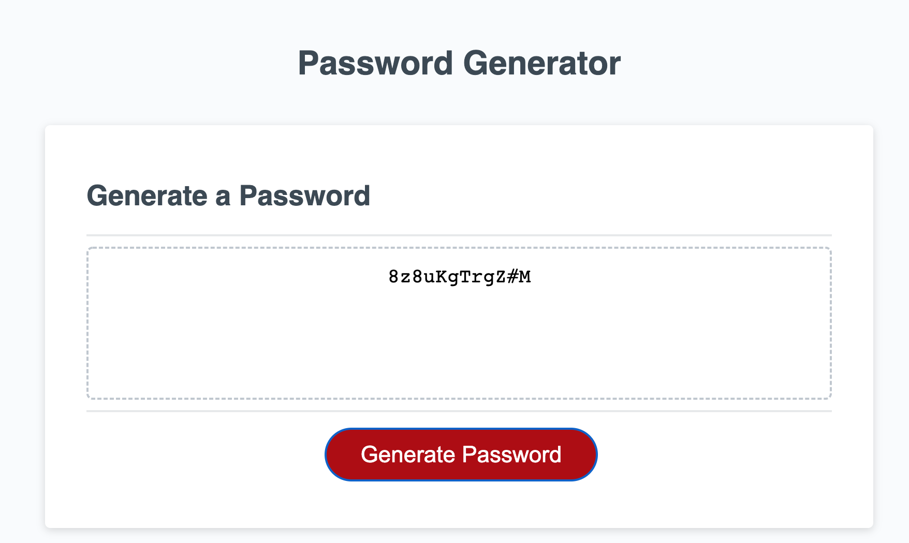

# Simple Password Generator

## Description

This application uses Javascript to randomly generate a secure password for the user. The app will allow the user to select whether or not their password will include uppercase & lowercase letters, numbers, and special characters. It is reccomended that all character types are included for added security. The user also chooses the length of the password (within 8 and 128 characters).

If the user does not choose a valid length, or does not select a character type from the list of prompts, then an error message will display showing the user what they have done wrong. 

## Screenshot 

## Deployed Application

link to the GitHub repository: 

link to the deployed application: 
